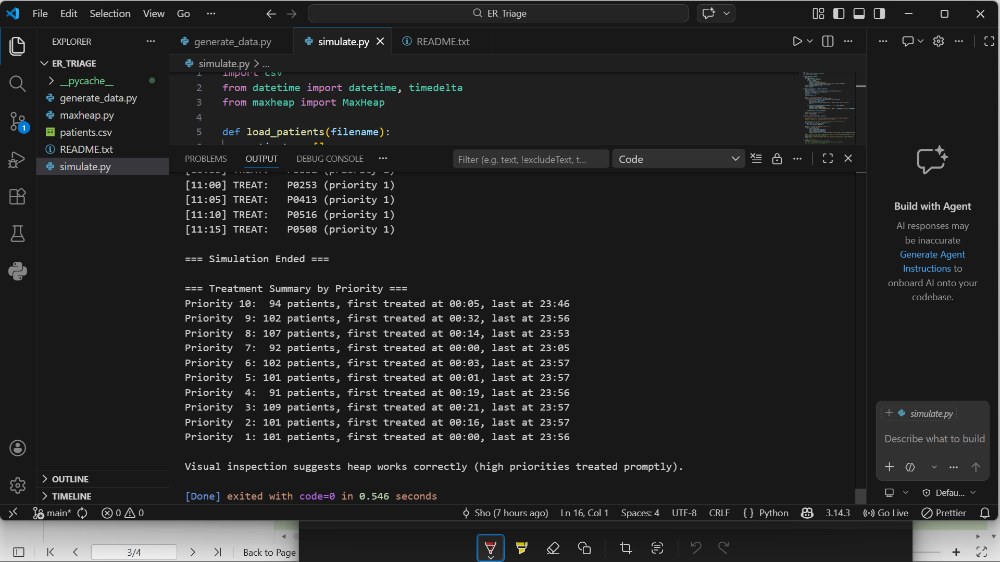

ER Triage System

Files:
- maxheap.py: Contains the MaxHeap class with all heap operations.
- generate_data.py: Creates a synthetic dataset of 1,000+ patients (saved as patients.csv).
- simulate.py: Runs the 24-hour ER simulation.
- patients.csv: The generated patient data.

How to run:
1. (Optional) To generate new data: python generate_data.py
2. To start simulation: python simulate.py

# Emergency Room Triage System
**Course:** Design and Analysis of Algorithms (CoSc3094)
**Institution:** Aksum University

## 👥 Group Members
1. Eyerusalem Teklay (AKU16023)
2. Weldearegay Abebe (AKU16034)
3. Shewit Legesse (AKU1602069)

---

## 📂 Project Deliverables
The PDF below contains our full analysis and complexity proofs.
👉 **[Click here to download the Full Project Report (PDF)](./ER-Triage-System.pdf)**

---

## 📊 Simulation Results

